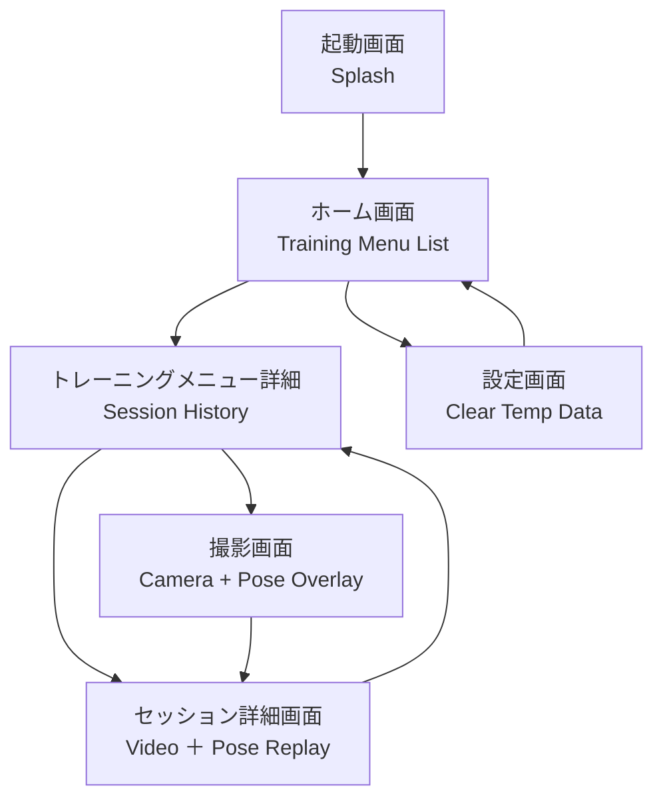

# 画面遷移図

```mermaid
graph TD
  %% ノード定義
  Splash[起動画面<br/>Splash] 
  Home[ホーム画面<br/>Training Menu List]
  MenuDetail[トレーニングメニュー詳細<br/>Session History]
  Recording[撮影画面<br/>Camera + Pose Overlay]
  SessionDetail[セッション詳細画面<br/>Video ＋ Pose Replay]
  Settings[設定画面<br/>Clear Temp Data]

  %% 画面遷移
  Splash --> Home
  Home --> MenuDetail
  Home --> Settings
  MenuDetail --> Recording
  MenuDetail --> SessionDetail
  Recording --> SessionDetail
  SessionDetail --> MenuDetail
  Settings --> Home
```
