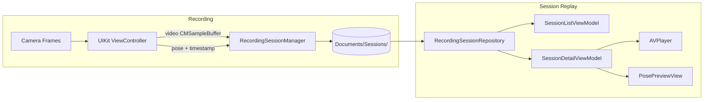

# PoseFinder: Structure（構成・アーキテクチャ）

- **最終更新日**: 2026-01-09
- **正本**: `docs/specs/*`（`docs/archive/specs/*` は参考資料）

## 1. リポジトリ構成（要点）

```
PoseFinder/                 # iOSアプリ本体
  App/                      # SwiftUI 移行レイヤー（Models/ViewModels/Views 等）
  UI/                       # 既存 UIKit 画面（撮影など）
  Utils/                    # 録画・シリアライズ・カメラ補助など
  Pose/                     # Pose 表現・後処理・採点関連（検証実装由来）
  Model/                    # Core ML PoseNet 系（併存、現行 UI 経路外が中心）
docs/
  specs/                    # 仕様の正本
  archive/specs/            # 旧仕様（参考）
Pods/                       # CocoaPods（ML Kit）
```

## 2. アプリのレイヤ構成

### 2.1 UI レイヤ

- **SwiftUI**（段階移行中）: `PoseFinder/App/Views/*`
  - 例: `HomeView`, `TrainingMenuDetailView`, `SessionListView`, `SessionDetailView`
- **UIKit（既存）**: `PoseFinder/UI/*`
  - 例: `ViewController`（撮影画面）
- **SwiftUI → UIKit ブリッジ**: `PoseFinder/App/Views/RecordingSessionContainerView.swift`
  - `UIViewControllerRepresentable` で Storyboard の `ViewController` を起動
  - 中断/完了は `NotificationCenter` で連携

### 2.2 状態管理 / ドメイン

- ViewModel: `PoseFinder/App/ViewModels/*`
  - `SessionListViewModel`: 保存済みセッション一覧をロード
  - `SessionDetailViewModel`: セッション再読み込み、動画プレイヤ、Pose プレビュー生成
- Model: `PoseFinder/App/Models/*`
  - `RecordingSession`: UI で扱うセッションメタ（ファイル URL、サイズ等）
  - `PoseFrame`: Pose NDJSON の1フレーム（プレビュー用途）

### 2.3 永続化 / I/O

- Repository: `PoseFinder/App/Repositories/RecordingSessionRepository.swift`
  - `Documents/Sessions/*` を走査し `session.json` を読み込む
  - `pose.ndjson` から先頭の有効 JSON 行を読み、`PoseFrame` を復元
- Recorder: `PoseFinder/Utils/RecordingSessionManager.swift`
  - 録画（`video.mp4`）と Pose（`pose.ndjson`）を同一セッションとして同期保存
  - 正常終了時のみ「未完了マーカー」を除去してセッションを確定

---

## 2.4 トレーニングメニュー構成

メニュー情報の取得は Protocol/Repository パターンで抽象化されている。

```
HomeViewModel
    ↓ (depends on)
TrainingMenuRepository
    ↓ (DI で切り替え可能)
TrainingMenuDataSource (Protocol)
    ├─ TrainingMenuLocalDataSource (バンドル/ドキュメント JSON)
    └─ TrainingMenuRemoteDataSource (将来 REST API 等)
```

- 実装では `PoseFinder/App/DataSources/TrainingMenuDataSource.swift` がインターフェース定義
- `PoseFinder/App/DataSources/TrainingMenuLocalDataSource.swift` がローカル JSON 読み込み
- `PoseFinder/App/Repositories/TrainingMenuRepository.swift` でキャッシュ・エラーハンドリング
- `PoseFinder/App/ViewModels/HomeViewModel.swift` は `TrainingMenuRepository` を `@StateObject` として保持
- 詳細画面は `TrainingMenuDetailViewModel` が `videoURL()` で動画を提供

ローカル設定ファイルは `Resources/training-menus.json` に格納され、
アプリ初回起動時に `Documents/PoseFinderTrainingMenus/` にコピーされる。

将来のリモート実装では `TrainingMenuRemoteDataSource` を追加し、
`TrainingMenuRepository` の初期化時にデータソースを差し替えるだけで良い。

## 3. セッション保存仕様（ファイルベース）

### 3.1 保存先

- `Documents/Sessions/<sessionId>/`

### 3.2 ファイル構成

- `video.mp4`: H.264 で保存されたユーザー動画
- `pose.ndjson`: 1行=1フレームの Pose（JSON Lines）
- `session.json`: セッションメタ情報（スキーマバージョン、端末/カメラ、動画情報 等）
- `.session_incomplete`: セッション未完了マーカー（正常終了時に削除）

### 3.3 `sessionId` 形式

- `yyyyMMdd-HHmmss-<random4>`（例: `20260109-120305-1234`）

## 4. データフロー（概観）



## 5. 例外系（中断/不完全データ）

- 録画中断（ユーザーが戻る/アプリがバックグラウンドへ移行等）では、原則としてセッションディレクトリを削除する
- 何らかの理由でディレクトリが残った場合でも `.session_incomplete` が残っていれば **未完了扱い** として UI で選択不可（または警告表示）にする

## 6. 参考

- 検証実装の構造整理: `docs/archive/specs/検証実装/CODEMAP.md`
- 検証実装の全体像: `docs/archive/specs/検証実装/OVERVIEW.md`
