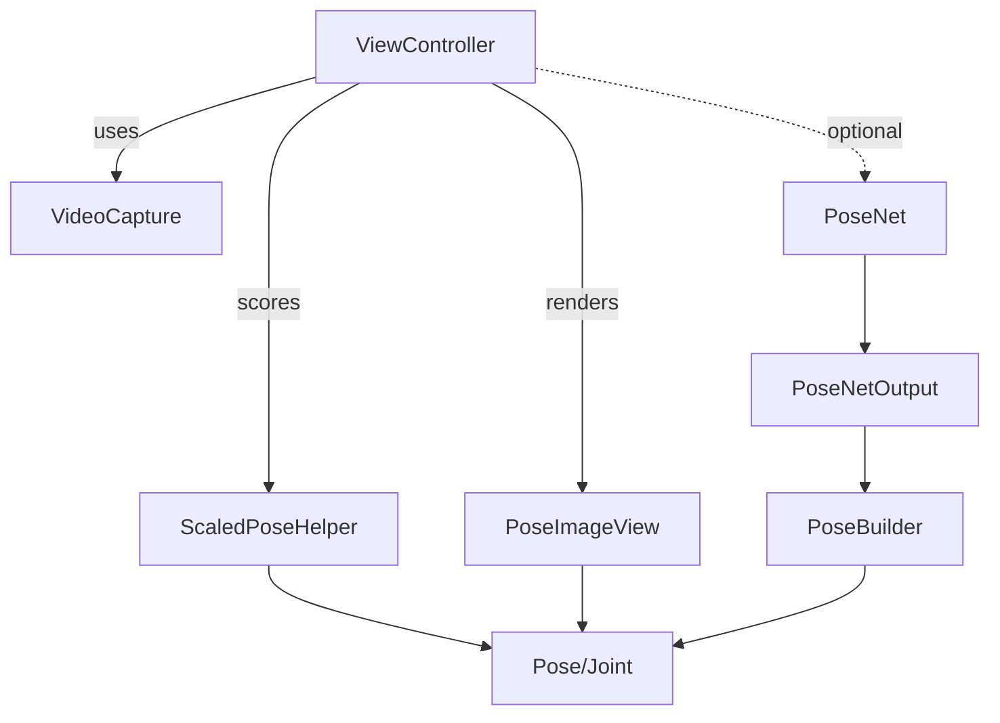

# コードマップ（CODEMAP）

本ドキュメントは、ディレクトリ構成と主要コンポーネントの役割/入出力/関連を一覧化します。

## ディレクトリツリー（要点）

```
PoseFinder/
  App/
  UI/
  Utils/
  Pose/
  Model/
  Extensions+Types/
Documentation/
```

- App: 起動/設定 (`AppDelegate.swift`, `Info.plist`)
- UI: 画面/描画/構成（`ViewController`, `PoseImageView`, `ConfigurationViewController`, ほか）
- Utils: カメラ入出力・向き (`VideoCapture`, `AVCaptureVideoOrientation+Extension`)
- Pose: ポーズ表現・推論後処理・スケーリング（`Pose`, `Joint`, `PoseBuilder*`, `ScaledPoseHelper`）
- Model: Core ML PoseNet 入出力（`PoseNet*`）
- Extensions+Types: `CGImage.size`, `CGPoint` の演算拡張

## 主要クラス/構造体/プロトコル（一覧）

| コンポーネント | パス | 役割 | 主プロパティ | 主メソッド | 入力 | 出力 | 関連 |
|---|---|---|---|---|---|---|---|
| `ViewController` | `PoseFinder/UI/ViewController.swift` | フロー制御。カメラ/動画→ML Kit→描画→スコア | `videoPoseDetector`, `moviePoseDetector`, `player`, `teacherPose` | `setupPoseDetectors()`, `setupAndBeginCapturingVideoFrames()`, `setupAndBeginCapturingMovieFrames()` | `CGImage`（カメラ/動画） | `PoseImageView.show(...)` 更新、`ScoreLabel` | `VideoCapture`, `PoseImageView`, `ScaledPoseHelper` |
| `PoseImageView` | `PoseFinder/UI/PoseImageView.swift` | 姿勢オーバーレイ描画 | `jointSegments`, `segmentLineWidth` 他 | `show(...)`, `drawLine(...)` | `Pose`（教師/生徒） + `CGImage` | `UIImage`（オーバーレイ） | `Pose`/`Joint` |
| `ConfigurationViewController` | `PoseFinder/UI/ConfigurationViewController.swift` | PoseNet 構成UI（しきい値等） | ラベル/スライダ | 値変更ハンドラ群 | UI | `PoseBuilderConfiguration` 更新 | `ViewController` |
| `VideoCapture` | `PoseFinder/Utils/VideoCapture.swift` | カメラから `CGImage` を生成 | `captureSession`, `videoOutput` | `setUpAVCapture()`, `startCapturing()`, `stopCapturing()`, `flipCamera()` | カメラデバイス | `CGImage?` via delegate | `VideoCaptureDelegate` |
| `Pose` | `PoseFinder/Pose/Pose.swift` | ポーズ表現（関節集合/骨格エッジ） | `joints`, `edges`, `confidence`, `score` | `edges(for:)`, `edge(from:to:)` | - | - | `Joint`, `PoseBuilder*` |
| `Joint` | `PoseFinder/Pose/Joint.swift` | 関節表現（位置/信頼度/有効/スコア） | `name`, `position`, `confidence`, `isValid`, `score` | - | - | - | `Pose` |
| `PoseBuilder` | `PoseFinder/Pose/PoseBuilder*.swift` | PoseNet 出力→ポーズ構築（単体/複数） | `output`, `configuration` | `pose`（単体）, `poses`（複数） | `PoseNetOutput` | `Pose` | `PoseNetOutput`, `PoseBuilderConfiguration` |
| `PoseBuilderConfiguration` | `PoseFinder/Pose/PoseBuilderConfiguration.swift` | しきい値/探索半径等の設定 | 各種閾値・件数 | - | - | - | `PoseBuilder` |
| `ScaledPoseHelper` | `PoseFinder/Pose/ScaledPoseHelper.swift` | 教師基準のスケーリングと採点 | `teacherPose`, `studentPose`, 重心/比率 | `getScaledPose()` | 教師/生徒 `Pose` | スケール済み教師 `Pose`, 採点済み生徒 `Pose` | `PoseImageView` |
| `PoseNet*` | `PoseFinder/Model/PoseNet*.swift` | Core ML PoseNet 呼び出し/入出力 | `poseNetMLModel` 等 | `predict(_:)` | `CGImage` | `PoseNetOutput` → `PoseBuilder` | `ViewController`（経路は併存） |
| `CGPoint+Extension` | `PoseFinder/Extensions+Types/CGPoint+Extension.swift` | ベクトル演算/距離/スケーリング | - | `distance(...)` 他 | - | - | `PoseBuilder*` |
| `CGImage+Extension` | `PoseFinder/Extensions+Types/CGImage+Extension.swift` | `size` 取得 | - | - | - | - | `PoseBuilder` |

## データモデル
- `Joint.Name`: 17 関節の列挙（nose, eyes, ears, shoulders, elbows, wrists, hips, knees, ankles）
- `Pose.edges`: 骨格線の接続定義（右/左の四肢 + 肩/腰の横方向）
- `Pose.confidence`: 関節信頼度平均（PoseNet 経路）
- `Pose.score` / `Joint.score`: スケーリング後の関節距離を基に算出（ML Kit 経路の可視化用）

## 相互依存（概念図）



