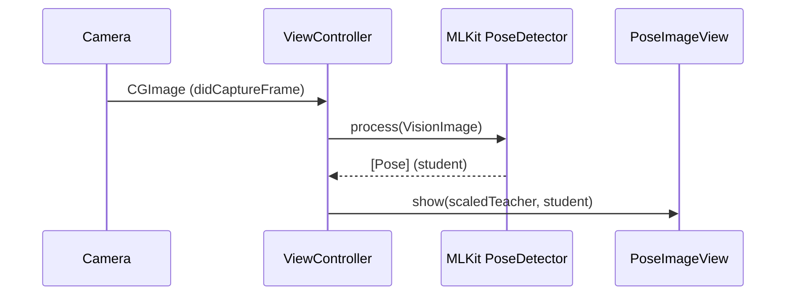

# ユースケース（USECASES）

本ドキュメントは、現状実装済みの主なユースケースと入出力シーケンス、既知の制約/性能目標（草案）をまとめます。

## 目次
- UC1: ライブカメラで生徒ポーズ検出・描画
- UC2: 同梱動画から教師ポーズ検出・描画
- UC3: 教師×生徒のスケーリングと採点
- UC4: 設定ビュー（参考：PoseNet 経路）
- 既知制約
- 性能目標（草案）

## UC1: ライブカメラで生徒ポーズ検出・描画
- 入力: デバイスカメラ（`AVCaptureSession`）
- 処理:
  1) `VideoCapture` が `CGImage` を生成（遅延フレーム破棄あり）
  2) `ViewController` が ML Kit `PoseDetector` へ渡し、`Pose`（生徒）を得る
  3) `PoseImageView.show()` が教示（スケール済）/生徒を重ね描画
- 出力: 画面上にオーバーレイ描画、`ScoreLabel` にスコア
- 例外/エラー: 検出失敗（空配列）時は描画スキップ、ログ `print`

## UC2: 同梱動画から教師ポーズ検出・描画
- 入力: バンドル動画 `traning.mp4`
- 処理:
  1) `AVPlayer` + `AVVideoComposition` でフレームを `CIImage` → `CGImage` 化
  2) `ViewController` が ML Kit でポーズ検出、先頭 `Pose` を `teacherPose` として保持
  3) `PoseImageView.show()` で教師の可視化（参考）
- 出力: 教師ポーズのオーバーレイ（青）

## UC3: 教師×生徒のスケーリングと採点
- 入力: `teacherPose`, `studentPose`
- 処理:
  - `ScaledPoseHelper.getScaledPose()`:
    - 教師/生徒の重心計算 → 平行移動
    - 教師基準でスケーリング（比率は肩・股関節基準）
    - 各関節距離→`Joint.score` を計算、平均化して `Pose.score`
- 出力: スケール済み教師 `Pose`、採点済み生徒 `Pose`
- 可視化: 教師（青）、生徒（赤：関節点はスコアに応じ赤→緑）

## UC4: 設定ビュー（参考）
- `ConfigurationViewController` は `PoseBuilderConfiguration`（PoseNet 経路）を編集可能
- 現行の ML Kit 経路とは連動が限定的（しきい値/人数は別設定）

## 既知制約
- 時系列スムージング/外れ値除去（ML Kit 経路）未実装 → ジッターの可能性
- パフォーマンス計測/メトリクス（fps/latency/CPU/GPU/温度）未実装
- マルチパーソン対応・切替 UI 不在（ML Kit オプション既定値の確認が必要）
- PoseNet 経路は併存だが現行 UI 経路外（役割整理が必要）

## 性能目標（草案）
- ターゲット fps: 30fps 以上（対応端末での中央値）
- 推論レイテンシ: カメラ路 33ms 以内目標（端末依存）
- リソース: 温度・サーマル状態が上昇しにくいサンプリング/間引き設計
- ログ/指標: fps、平均/95%レイテンシ、サーマル状態、CPU/GPU/ANE 利用傾向

